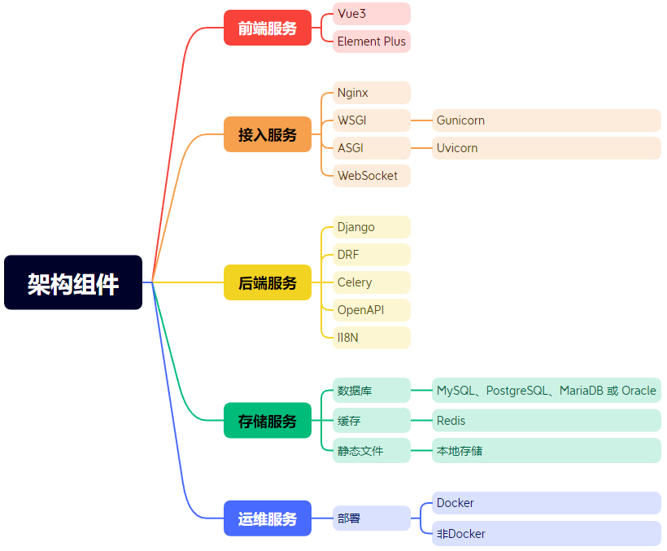

# MarsMgn 火星信息平台

**愿景：向 ruoyi 学习，构建国内优秀的快速开发平台**

**使命：赋能开发者提升效率，助力企业信息标准化**

**价值观：不重复造轮子，开放共享，合作创新**

## 介绍

MarsMgn 火星信息平台，基于 Django + DRF + Vue3 + Element Plus 实现的后台管理系统。以开发者为中心，构建国内优秀的开源快速开发平台。项目全部开源，个人与企业可 100% 免费使用。如果这个项目让你有所收获，记得 Star 关注哦，这对我是非常不错的鼓励与支持。

> 有任何问题，或者想要的功能，可以在 _Issues_ 中提交。
>
> 😜 给项目点点 Star 吧，这对我们真的很重要！

## 架构组件

- **前端服务**：使用 Vue3 框架，结合 Element Plus 进行前端开发，提供现代化的用户界面和交互体验。

- **接入服务**：
  - 使用 Nginx 作为反向代理服务器，处理静态文件和负载均衡。
  - 采用 WSGI 服务器 Gunicorn 和 ASGI 服务器 Uvicorn，支持异步请求处理和 WebSocket 通信。
  
- **后端服务**：

  - 基于 Django 框架，结合 DRF（Django REST framework）构建 RESTful API，实现高效的数据交互。
  - 使用 Celery 进行异步任务处理，提高系统响应速度。
  - 使用 Celery 进行定时任务调度，通过 Cron 表达式灵活设置执行周期。
  - 集成 OpenAPI 规范，支持 API 文档自动生成。
  - 使用 II8N（国际化）库，支持多语言环境。

- **存储服务**：

  - 数据库支持 MySQL、PostgreSQL、MariaDB 或 Oracle，提供灵活的数据存储解决方案。
  - 使用 Redis 作为缓存，提升数据访问速度。
  - 静态文件存储支持本地存储，确保文件的快速访问。

- **运维服务**：部署支持 Docker 和非 Docker 环境，提供灵活的部署选项。

- **权限认证**：

  - 实现基于 JWT（JSON Web Token）的认证机制，确保用户身份验证的安全性和便捷性。
  - 采用 RBAC（基于角色的访问控制）权限模型，灵活管理用户权限，支持细粒度的访问控制。
  - 支持数据权限控制，确保用户只能访问其被授权的数据，增强数据安全性。

- **动态权限管理**：支持动态权限菜单加载，实现按钮级别的权限控制，提升系统的安全性和灵活性。

- **实时通信**：通过 WebSocket 实现实时通信，内置 Token 身份校验。

- **代码生成器（规划中）**：提供代码生成器，支持一键生成 Python、Vue 前后端代码、SQL 脚本和接口文档，提高开发效率。

- **报表与大屏设计（规划中）**：集成报表设计器和大屏设计器，通过拖拽即可生成酷炫的报表与大屏，提升数据可视化能力。

- **工作流管理（规划中）**：集成工作流引擎，支持动态表单、在线设计流程、会签/或签以及多种任务分配方式。

## 项目关系

| 项目类型 | 项目名称     | Gitee 地址                                       | Github 地址                                         |
| -------- | ------------ | ------------------------------------------------ | --------------------------------------------------- |
| 后端     | mars-mgn     | [Gitee](https://gitee.com/zhulj993/mars-mgn)     | [Github](https://github.com/david-zlj/mars-mgn)     |
| 前端     | mars-mgn-vue | [Gitee](https://gitee.com/zhulj993/mars-mgn-vue) | [Github](https://github.com/david-zlj/mars-mgn-vue) |

详细项目文档：[docs.marsmgn.cn](https://docs.marsmgn.cn)

## 开源协议

**为什么推荐使用本项目？**

- 本项目采用比 Apache 2.0 更宽松的 MIT License 开源协议，个人与企业可 100% 免费使用，不用保留类作者、Copyright 信息。
- 代码全部开源，不会像其他项目一样，只开源部分代码，让你无法了解整个项目的架构设计。
- 代码整洁、架构整洁，代码注释详细。
- 详细的文档，以及相关学习资料。

## 演示图

### 系统管理模块

### 基础设施模块

