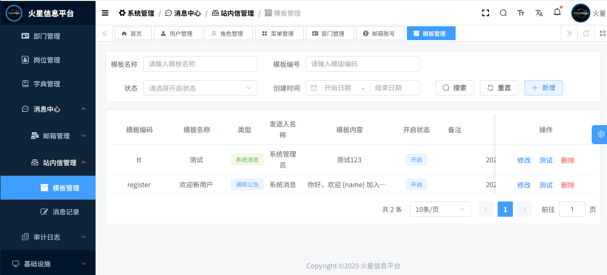

<h1 align="center" style="margin: 30px 0 15px; font-weight: bold;">MarsMgn</h1>
<h3 align="center" style="margin: 0 0 30px;">基于Django + Vue的企业级后台管理系统</h4>

    
    
        
    

- **🚀愿景：向 ruoyi 学习，构建国内优秀的快速开发平台**
- **🎯使命：赋能开发者，助力企业信息化**
- **🤝价值观：不重复造轮子，开放共享，合作创新**

##  平台简介

MarsMgn 火星信息平台，基于 Django + DRF + Vue3 + Element Plus 实现的企业级后台管理系统。以开发者为中心，构建国内优秀的快速开发平台。项目全部开源，个人与企业可 100% 免费使用。如果这个项目让您有所收获，记得 Star 关注哦，这是非常不错的鼓励与支持。

> 有任何问题，或者想要的功能，可以在 _Issues_ 中提交。
>
> 😜 给项目点点 Star 吧，这对我们真的很重要！

## 为什么推荐使用本项目？

- **无限制使用**：MIT 协议授权，个人与企业 100% 免费商用，无需保留版权信息，比 Apache 2.0 更宽松。
- **完善的支持**：拥有全网最详细的项目文档（[docs.marsmgn.cn](https://docs.marsmgn.cn/)）及配套学习资料，从入门到进阶全覆盖，搭配社区交流群，满足学习、工作和二次开发需求。
- **高效开发体验**：主流技术栈（Django4.2+Vue3 等）架构清晰，注释详尽，开箱即用，减少重复开发。
- **全量开源透明**：拒绝 “半开源”，代码 100% 公开，从架构到细节无隐藏，可自由修改二次开发。
- **企业级功能**：内置 RBAC 权限、系统管理、基础设施等模块，支持多场景部署，适配复杂业务需求。

| 项目 | 项目名称     | 项目地址                                                     |
| ---- | ------------ | ------------------------------------------------------------ |
| 后端 | mars-mgn     | [Gitee](https://gitee.com/zhulj993/mars-mgn)    [Github](https://github.com/david-zlj/mars-mgn) |
| 前端 | mars-mgn-vue | [Gitee](https://gitee.com/zhulj993/mars-mgn-vue)    [Github](https://github.com/david-zlj/mars-mgn-vue) |

## 社区交流群

欢迎加入交流群探讨技术问题、分享使用经验，入群前别忘了给项目点个 Star 支持一下哦～

- QQ 群号：772604565
- 入群答案：marsmgn

## 内置功能

**系统管理模块**

- 用户管理：对系统用户的信息进行管理，JWT 认证，Vue3+Element Plus 实现界面交互。

- 角色管理：用于定义和管理系统中的角色，实现基于RBAC 模型的角色访问控制。 

- 菜单管理：负责系统菜单的配置，包括菜单名称、排序、权限标识、组件路径等。

- 部门管理：对企业的部门结构进行管理，可维护部门名称、排序、状态等信息。

- 岗位管理：管理企业内部的岗位信息，包括岗位名称、编码、排序等。

- 字典管理：用于管理系统中使用的字典数据，为系统提供统一的数据标准，方便数据的一致性维护和展示。

- 邮箱管理

- 邮箱账号：配置用于发送邮件的邮箱账号信息，包括用户名、邮箱地址、SMTP 服务器域名、是否开启 SSL 等。
- 邮件模板：定义邮件发送的模板内容，可设置模板名称、编码、类型、内容等，便于快速发送标准化的邮件。
- 邮件记录：记录所有邮件的发送情况，包括发送人、接收人、发送时间、邮件内容、发送状态等，便于查看和追溯邮件历史。
- 站内信管理

- 模板管理：管理站内信的模板，可设置模板名称、编码、类型、内容等，支持模板的新增、修改、删除等操作，方便发送统一格式的站内信。
- 消息记录：记录站内信的发送和接收情况，便于用户查看和管理自己的站内信。
- 操作日志：记录用户在系统中的各种操作行为，包括操作类型、操作内容、操作时间、操作人等信息，用于审计和追踪用户操作。

- 登录日志：记录用户的登录情况，包括用户名称、登录地址、登录结果、登录日期等，可帮助管理员了解用户的登录行为和系统访问情况。

**基础设施模块**

- 表单构建：提供可视化的表单设计功能，支持拖拽基础组件（如输入框、多选框、单选框等）到设计区域进行表单搭建，可配置表单名称、标签位置、尺寸等属性，还能生成 JSON、Options 和组件代码，方便快速创建表单。

- WebSocket：支持实时通信功能，可配置服务地址，通过输入消息进行实时发送和接收，内置 Token 身份校验，能显示连接状态。

- 文件管理

- 文件配置：对文件存储相关的参数进行配置，如存储路径、上传大小限制等，确保文件管理功能的正常运行。
- 文件列表：展示系统中存储的所有文件信息，包括文件名、文件路径、URL、文件大小、文件类型等。
- 定时任务：用于管理系统中的定时任务，可设置任务名称、处理器名字、处理器参数、CRON 表达式等，支持任务的新增、修改、开启、暂停、删除等操作，能查看任务的执行状态和执行日志。

- 配置管理：管理系统的各种参数配置，包括参数分类、参数名称、参数键名等，支持参数的新增、修改、删除、导出等操作。

- 系统监控

- Celery 监控：集成 Flower 工具，对 Celery 异步任务队列进行监控，可查看任务的执行情况、队列长度、 worker 状态等信息，帮助管理员了解异步任务的处理情况。

## 演示图

### 系统管理模块

### 基础设施模块

